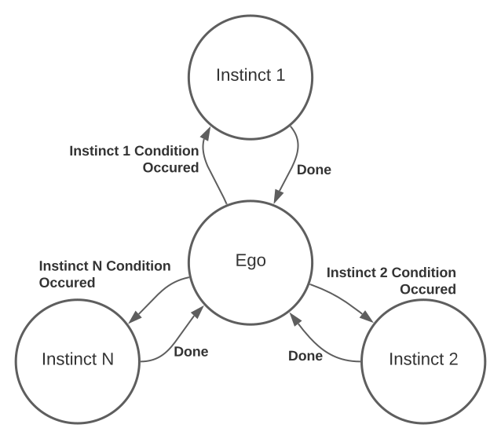

# AiiveOS Application Level ROS Package

The application level consists of three types of nodes:

- Ego node
- Instinct node
- Reflex node

Each type of node has a different priority and condition of execution. The structure aims to provide a reliable but flexible system to increase the device's survivability by implementing a state machine familiar for the device user.

## Node type definitions

**Ego node** - normally it is a single node responsible for the execution of the program for the normal device operating mode. The Ego program can consist of many consequently executed concepts.

**Instinct node** - a node executing a long sequence of actions in a single concept. The purpose of the instinct is to provide an immediate response for a critical situation overriding Ego node control over the device.

**Reflex node**  - this node carries a short simple action(s) in a single concept. Those actions will be executed in parallel to Ego or Instincts.

## Node interaction

Interaction between the **Ego** and **Instincts** form a state machine:

Meanwhile, **Reflexes** can occur **in parallel** and they can take a place in a queue for execution right in the middle of any other action including other reflexes.

## Development strategy

A developer should implement their own nodes based on EgoNode, InstinctNode, and ReflexNode classes using available for each class publics methods and implementing class-specific callbacks.

Common for all classes methods:

- `start`
- `send_cmd`
- `write_to_emotion_core`

### EgoNode based class

There should be only one Ego node running at the same time.

The developer should implement:

- json-files with command concept descriptions.
- `main(self)`. This method will be executed in the infinite loop right after the node start

Note: instead of `time.sleep` it is highly recommended to use the `wait` method

### InstinctNode based class

The developer should implement:

- json-files with instinct command concept descriptions.
- `callback_perception_concept(self, symbol, modifier)` method. This method will be executed when any of the perception concepts is published by the Data-to-Concept Interpreter. It is supposed that the node will be waiting for some specific concept and execute the appropriate command concept.

### ReflexNode based class

The developer should implement:

- json-files with Reflex command concept descriptions.
- `callback_perception_concept(self, symbol, modifier)` method. This method will be executed when any of the perception concepts is published by the Data-to-Concept Interpreter. It is supposed that the node will be waiting for some specific concept and execute the appropriate command concept.

---

## 

This repository is part of the [AliveOS](https://github.com/an-dr/aliveos) project.
